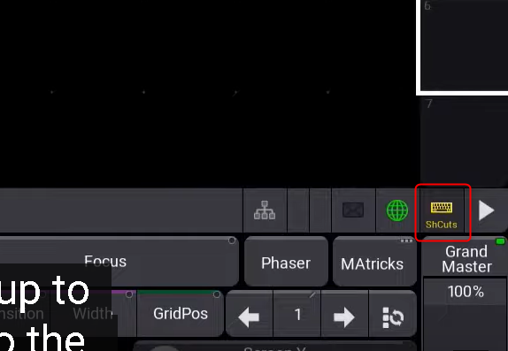
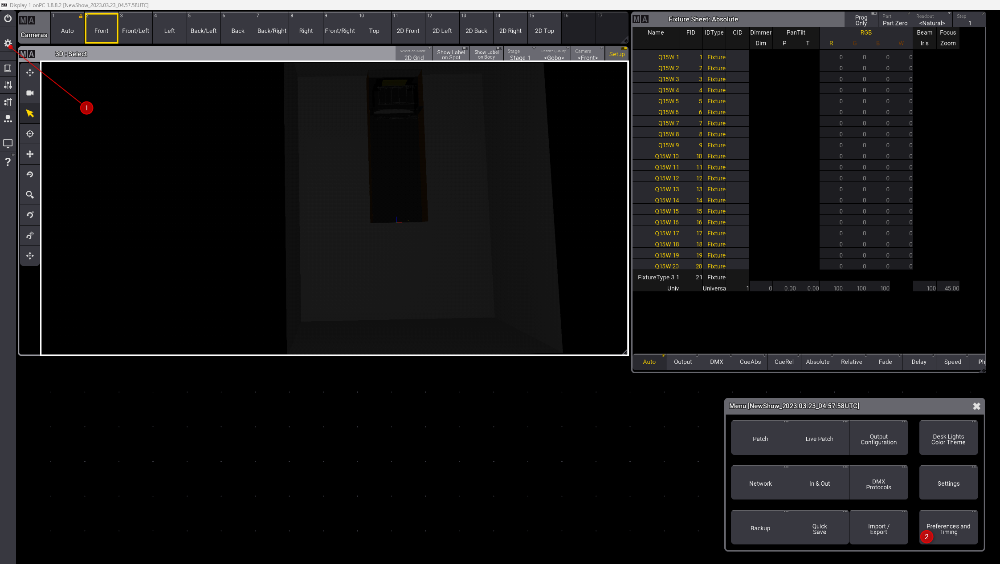
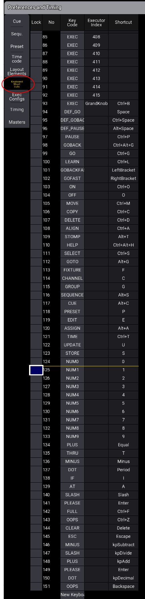
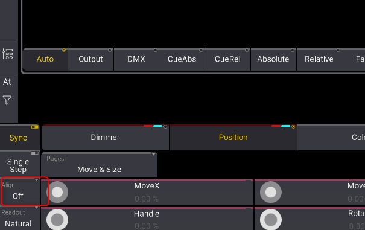
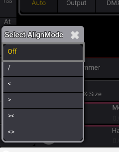
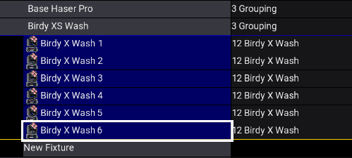

# utilisation en général

## jog

sur un Jog, vous pouvez utiliser le molette ou faire des ronds autour avec la souris


## raccourcis clavier

activer les raccouris clavier


ou F10

Modifier un raccourci **Atention au clavier qui est en QWERTY**





Oops control W

clear supprime

Preset P

1 thru (va sélectionner jusqu'au dernier)

At Q

QQ => Allume le projecteur

.. => éteint le projecteur

Please please (entrer entrer) pour sélectionner tous les paramètres d'un projecteur

Stomp Alt + T

## Aligne et Thru

Il est possible d'utiliser la commande **THRU** pour sélectionner des fixtures

```
1 thru 10
```

```
1 thru 
```

--> Sélectionne jusqu'au dernier

Installation des appareils en 3D 

```
-3 thru 3
```

Utilisez le bouton aligne pour déplacer, pan, tilt, color picker





\ Aligne en symétrie
< croissant à droite
> Croissant à gauche
>< croissant du centre
<> Croissant des extérieurs

## Numérotation

En sélection de liste, il est possible de faire une numérotation automatique en faisant ESPACE NUMERO



## 3D blender

*Ajouter 3DS à blender

télécharger le zip de https://www.google.com/url?sa=t&rct=j&q=&esrc=s&source=web&cd=&cad=rja&uact=8&ved=2ahUKEwiVh5bj0u79AhVHUKQEHaorBcwQFnoECBsQAQ&url=https%3A%2F%2Fgithub.com%2Fblender%2Fblender-addons-contrib&usg=AOvVaw0P0vefKFbnvsO_TdI-UZQ9

et prendre io_scene_3ds à l'intérieur de ce zip pour le reziper et installer cette extension solo dans blender