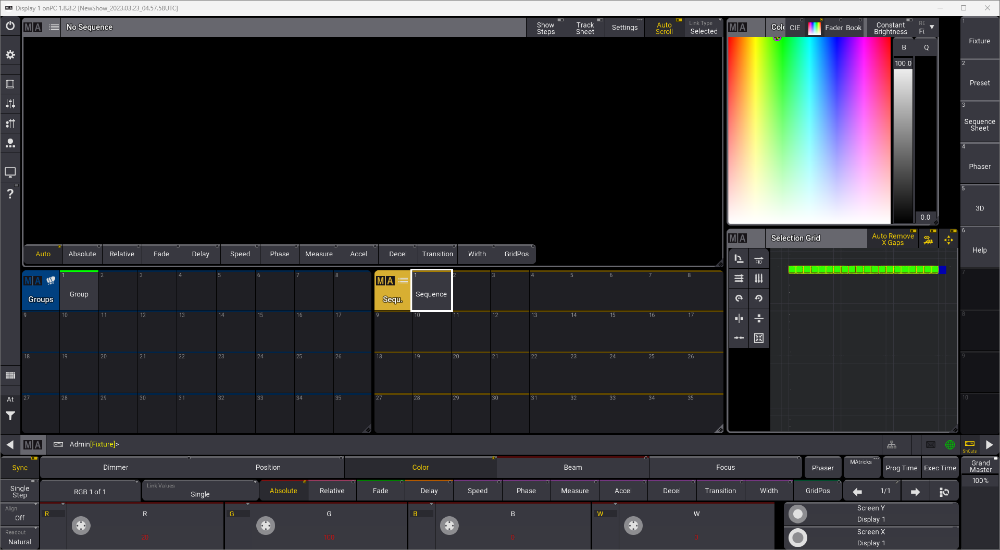
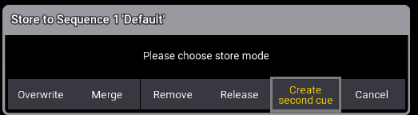
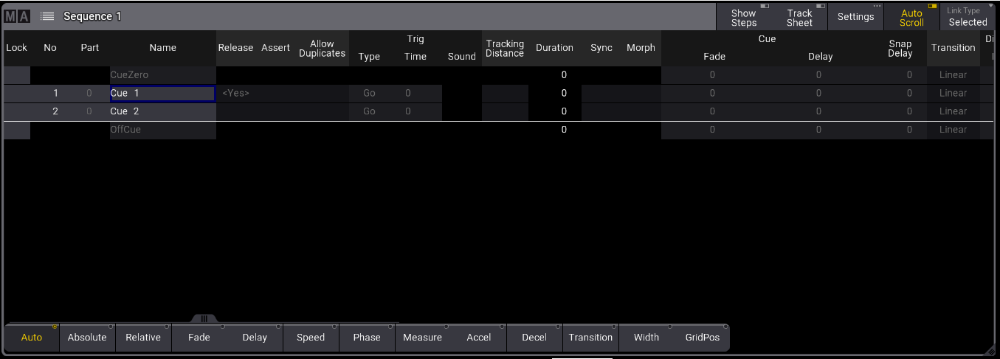
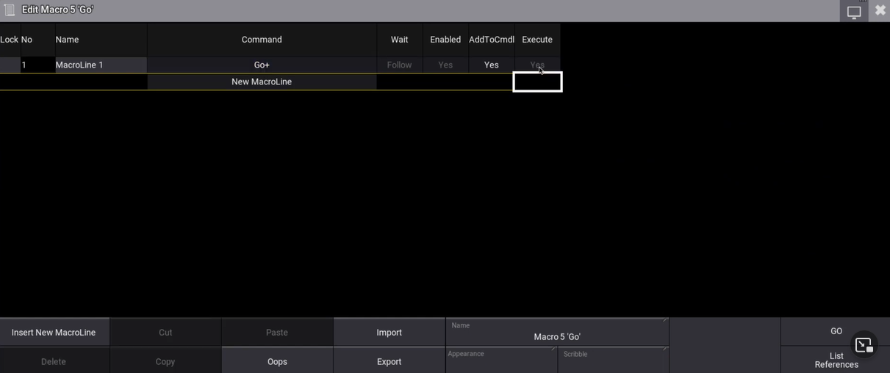
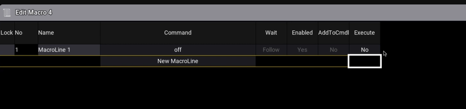
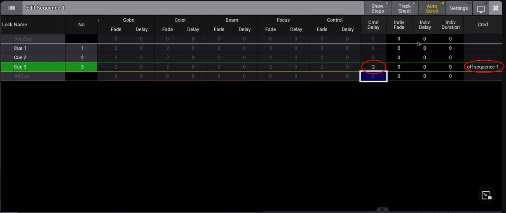
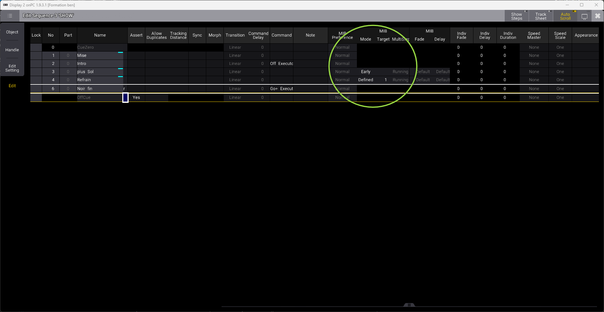
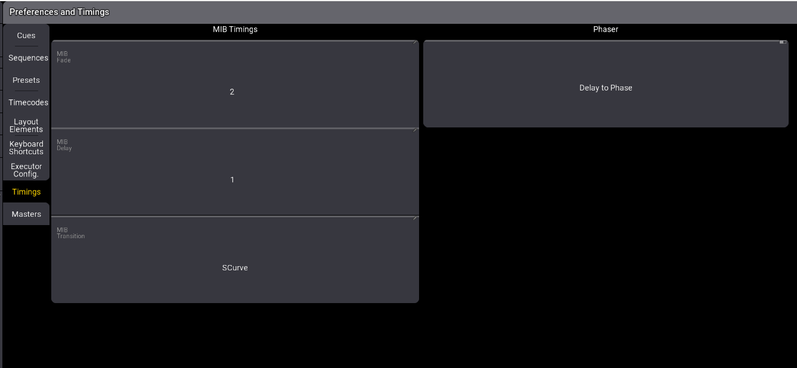
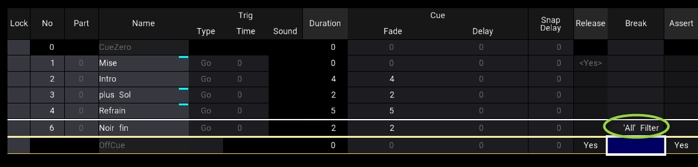
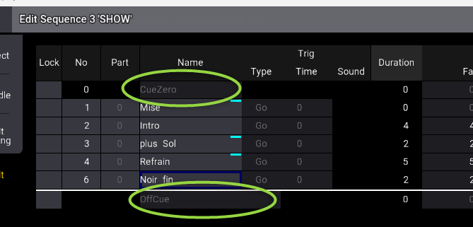

# Les séquences

Pour créer un séquence, faire un état lumineux, click gauche long sur une case de la window **Sequence**

Modifier l'état lumineux, et glissé bas sur ce bouton, puis store. Grandma3 va demander s'il créé un second pas.

Sélectionner Creat **second cue** pour créer un second pas

Il est possible aussi de faire edit, cliquer sur le cue, changer une valeur, puis update ok

POur lancer la séquence, il faut lancer la commande sur GO+ à chaque pas, ou modifier le type et time dans le tableau des cue

POur la macro go+, faire execute YES pour lancer le pas suivant à chaque appui de GO

Pour une macro OFF, ne pas faire execute YES

Pour éteindre une séquence à la fin de la lecture :
Dans Cmd au dernier pas, ajouter **off sequence 1** après avoir mis un cmd delay pour décaler le déclenchement de la commande

## MIB
Move in black

Pour préparer le pas suivant, il est possible de mettre sur le pas suivant : MIB early.
ça modifie en avance tous les paramètre sauf le dimmer.

Pour régler les temps de MIB, aller dans les réglages

## Tracking

Les séquences ont un tracking de suivi.
Les pas s'enchainent et conservent les paramètres précédent.

Il est possible de faire une pause sur le tracking, en ajoutant un cue suivant et revenir sur le précedent pour activer CUE Only.

Attention, en cas de modification d'un précédent cue, le tracking va continuer cette modification dans les pas suivants.

Break Filter All permet d'arreter le traking

## avant la séquence et après

Les réglages se font en cue zero et offcue

