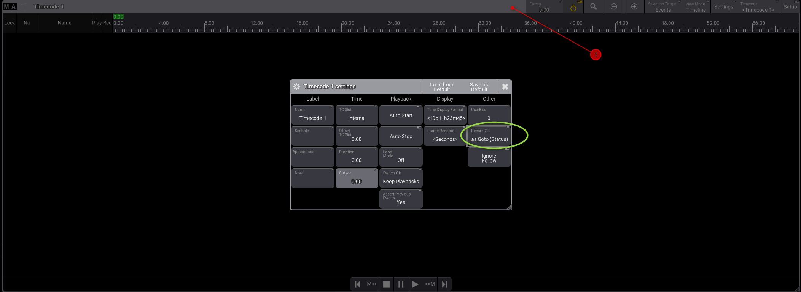

# TimeCode

créer les windows Timecode other et timecode view

créer un nouveau preset time code et cliquez dessus

Configurer dans setting en haut, pour mettre en goto

Pour un enregistrement live, cliquer sur **SETUP** puis **record** et cliquez sur les presets de votre choix, au bon moment

Pour assigner à la main sans passer par record
1. créer une new track en cliquant droit
2. Glisser bas sur la séquence puis assign, puis click sur la new track

3. cliquer sur + à gauche pour ajouter des GO

* resize un bloc

* empecher d'enregistrer par dessus une track

* se déplacer dans la timeline
cliquer sur les 2 boutons de la souris et glisser