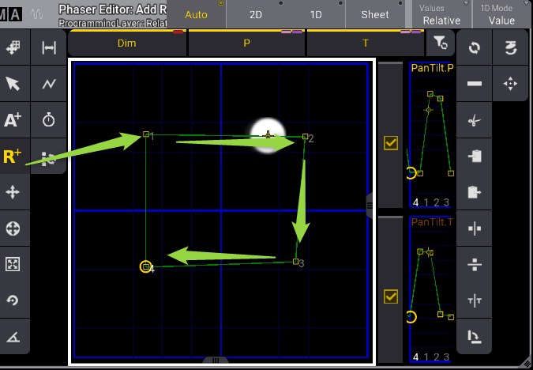
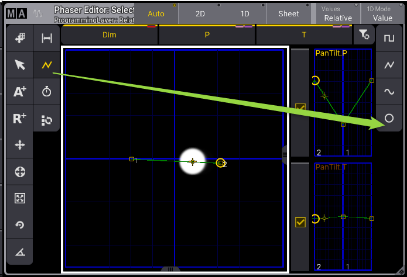
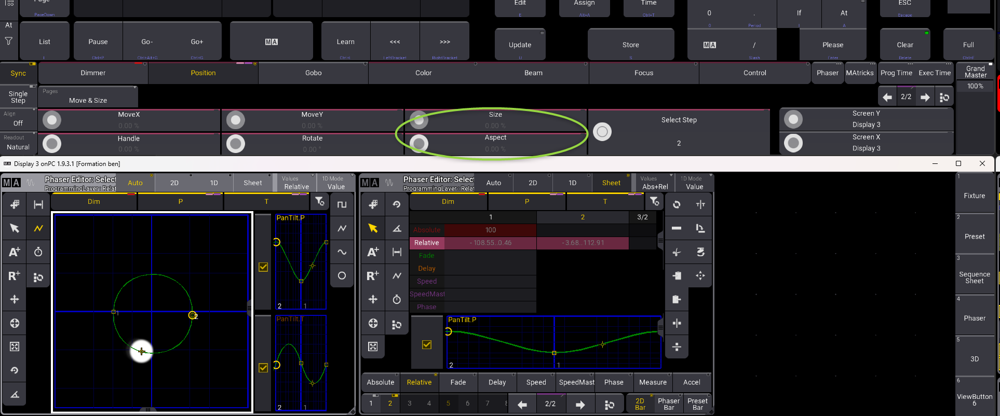
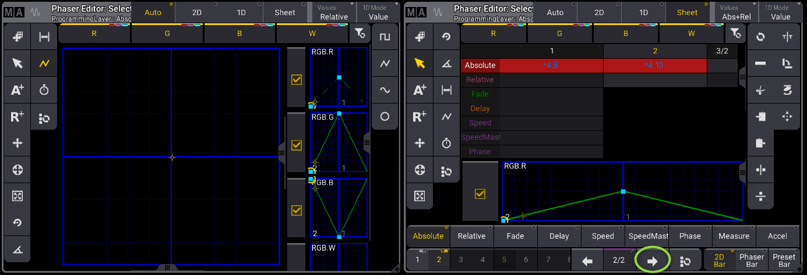

# Phaser

POur un mouvement de lyre
Ajouter les point en relatif (se base de la position des lyres actuelles)
ou Absolute (en reel sur la grille)

POur faire un cercle, ajouter 2 points et changer la courbe

Vous pouvez régler la taille de la forme avec les jogs

Pour les couleurs, ajouter les pas

## Arreter un phaser

Stomp + Dimmer
ou Stomp + position
(ALT + T)
