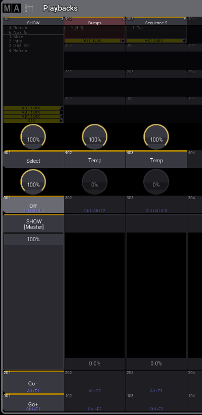

# Playback

Pour fixer un executer sur toute les pages :
Shift ou MA + Fix

Pour changer les fonctions des boutons de chaque colonne

## Intervention.

Il est possible de faire une intervention sur une séquence qui tourne, en ajoutant une seconde séquence en parallèle.

Mettre le key en TEMPS

