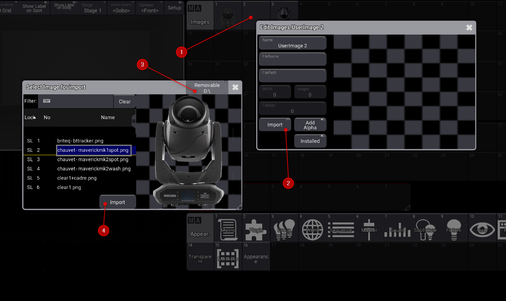
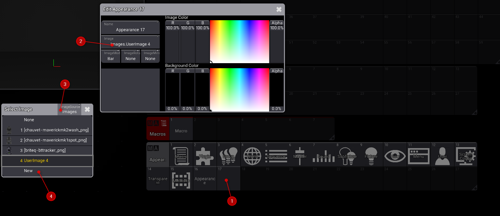
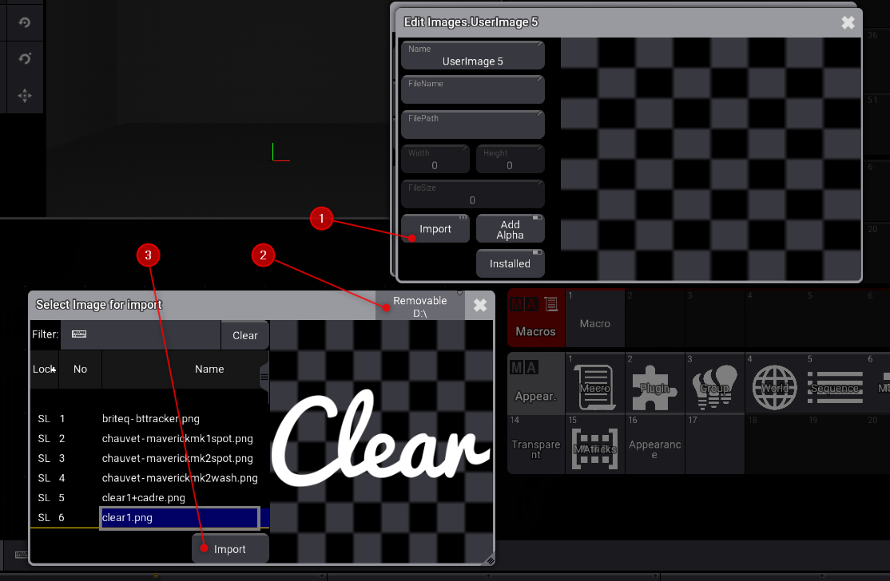
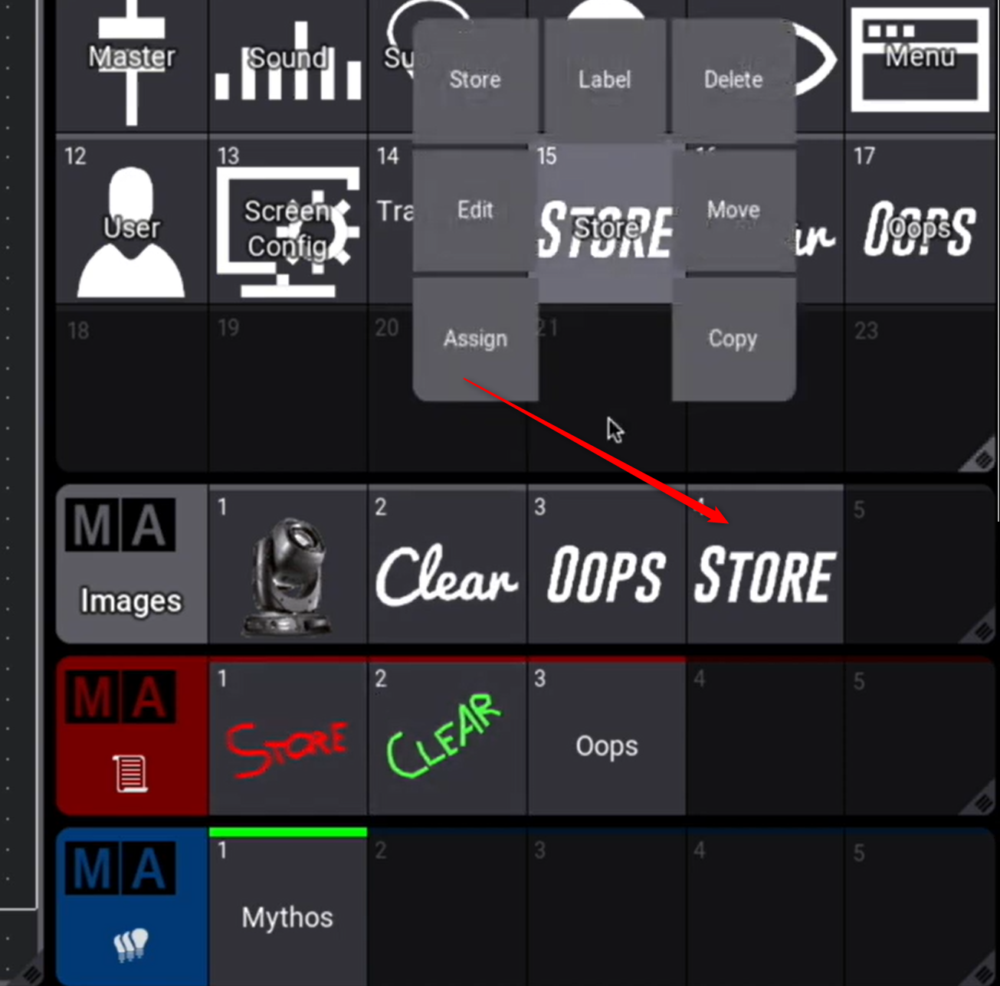

# images

* Ajouter des images dans la clé usb
D:\grandMA3\gma3_library\media

* et rerouvez importer des images dans la window images :
click droit, import, removable disk

# Apparences
*Pour changer l'apparence des boutons

*Glissé bas et assign sur l'apparence, puis clic sur le bouton souhaité

