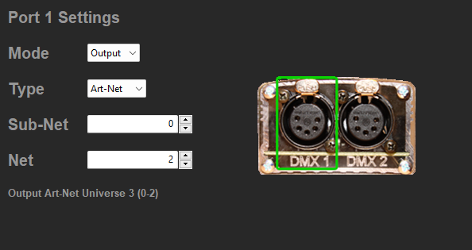
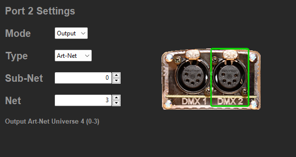
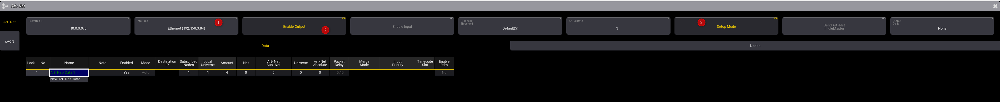
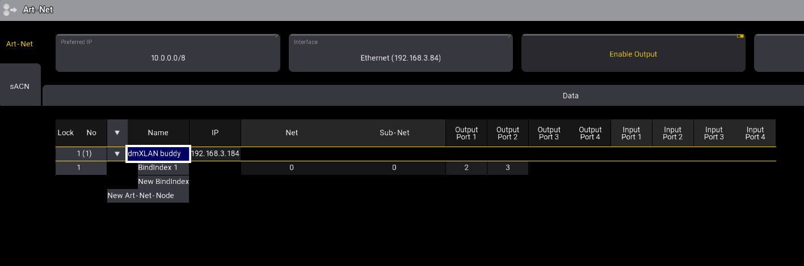

# Connexion des boitier ARtnet

1. Configurer le boitier avec le logiciel
débrancher et rebrancher le boitier

Choisir l'univers désiré par sortie
Ici le port 1 = U3
port 2 = U4

2. configurer grand ma

Choisir la carte réseau

enable output

enable setup pour découvrir les nodes

3. Dans data, réglez le flux de sortie, puis dans nodes, régler les nodes

Local univers : premier univers envoyé dans le flux
amount : puis combien d'univers sont envoyés dans le flux.

4. vérifiez la présence du boitier, les ports doivent reprendre les univers.
NE PAS REGLER ICI ça ne fonctionne pas bien

