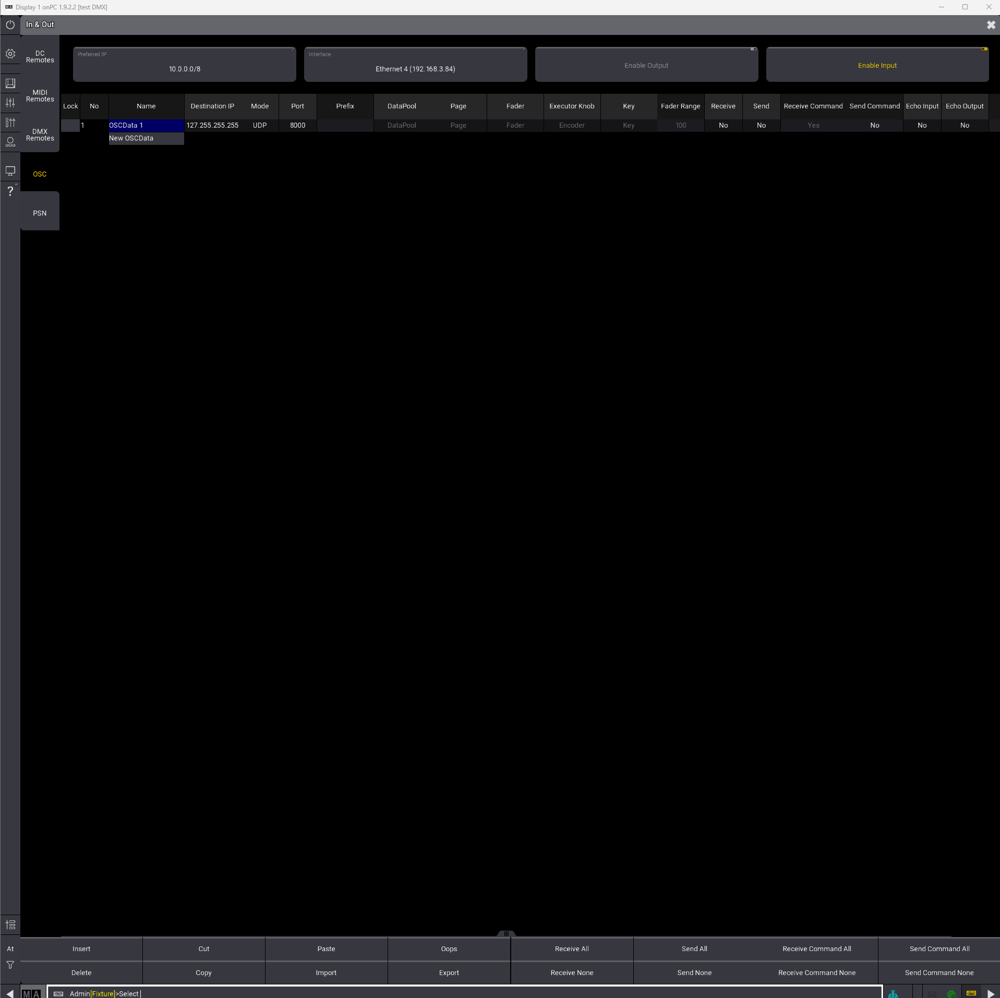
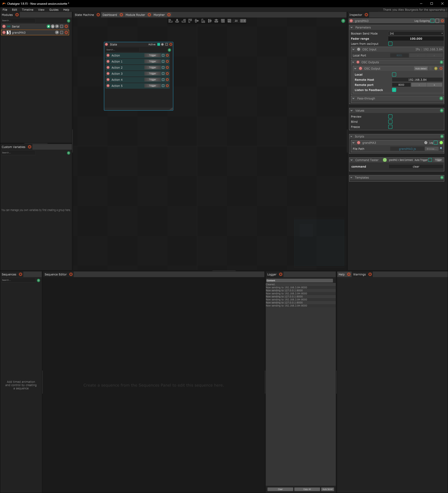
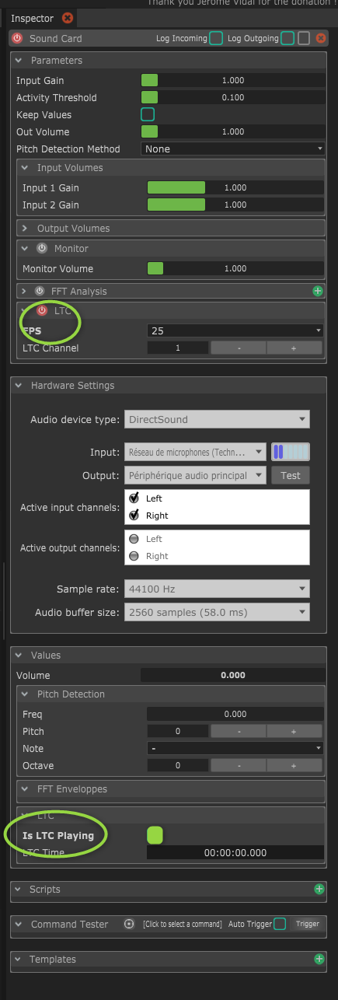
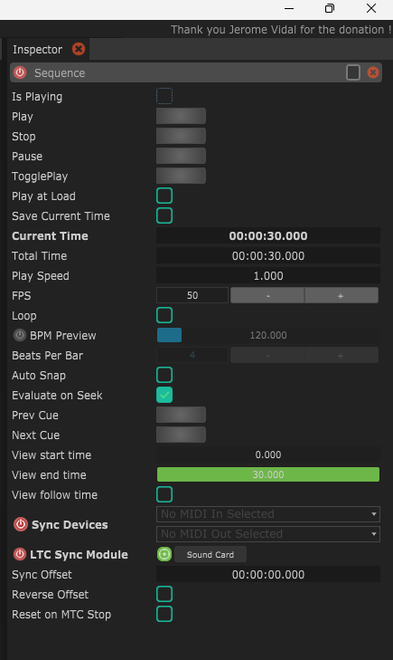
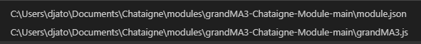
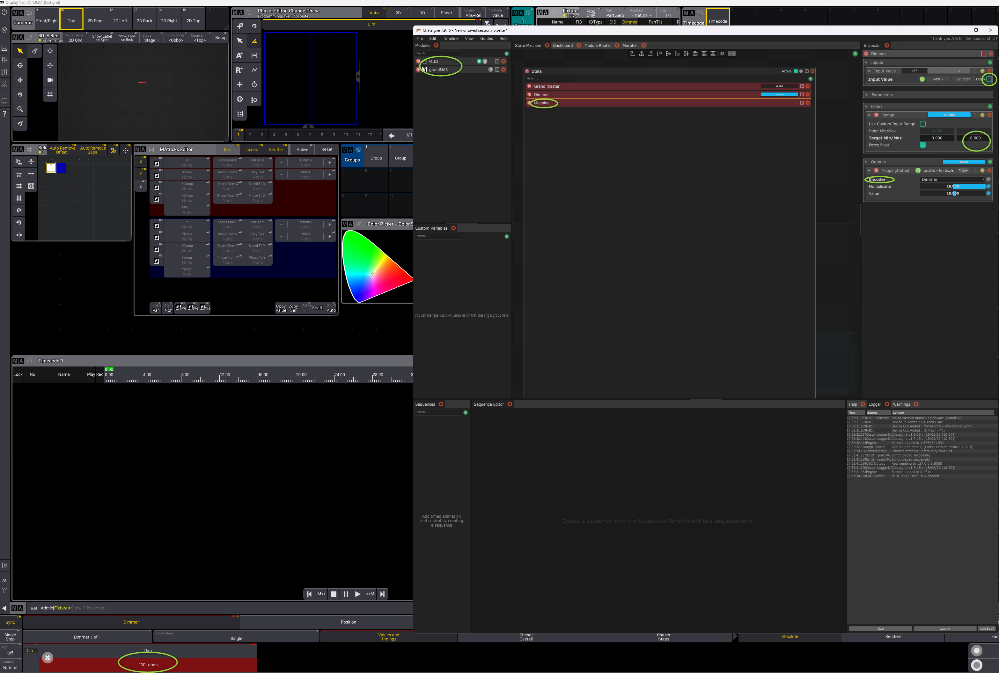

# OSC
## Connexion avec chataigne

Activer OSC dans Grand MA3


Dans Chataigne installer le module grand ma3



# Timecode

Configurer grand ma
Menu/settings/onpc setting
Activer le slot1, régler le midi in device

DAns chataigne
Importer un Hardware sound card

Sélectionner la carte son, activer le LTC régler les FPS, activer le LTC is playing



Ajouter un séquence et configurer l'entrée LTC de la sound card et le départ dans la carte midi



télécharger les LTC
https://elteesee.pehrhovey.net/

# Midi



Changer les valeurs min et max à 100 dans module.json

```JS
     "menu":"",  
      "callback":"turnEncoder",
      "parameters":
      {
        "Encoder": 
        {
          "type":"Enum", "options": 
          {
            "Dimmer": "Dimmer",
            "Pan": "Pan",
            "Tilt": "Tilt",
            "Shutter1": "Shutter1",
            "Prism1": "Prism1",
            "Focus1": "Focus1",
            "Zoom": "Zoom",
            "Gobo1": "Gobo1",
            "Gobo2": "Gobo2",
            "Color1": "Color1",
            "ColorRGB_R": "ColorRGB_R",
            "ColorRGB_G": "ColorRGB_G",
            "ColorRGB_B": "ColorRGB_B",
            "ColorRGB_W": "ColorRGB_W",
            "ColorRGB_WW": "ColorRGB_WW",
            "ColorRGB_CW": "ColorRGB_CW",
            "ColorRGB_UV": "ColorRGB_UV",
            "Blower1": "Blower1",
            "Haze1": "Haze1"
          }
        },
        "Multiplicator": {"type": "Float", "min":-10, "max":10, "default":1, "description":"Speed of the encoder movement, only relevant for endless encoders"},
        "Value": {"type": "Float", "ui":"slider", "min":-100, "max":100, "default":0, "mappingIndex": 0}
      }
```

et dans grandma3.js
```JS
function turnEncoder(encoder, multiplicator, value) {
  // script.log("Attribute " + encoder + " at + " + value*multiplicator);
  // local.send("/cmd", "Attribute " + encoder + " at + " + value*multiplicator);
  script.log("Attribute " + encoder + " at " + value*multiplicator);
  local.send("/cmd", "Attribute " + encoder + " at " + value*multiplicator);
}

```



