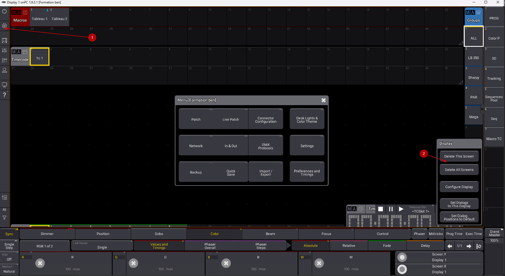

## Affichage

* vider toutes les views en cliquant sur ces boutons

* Après avoir activé les raccouris

* CTRL D puis click sur les onglets de views

### Création de nouvelle view
* pour créer une nouvelle view, faites une selection dans la fenètre qui va accueillir votre nouvelle window

* sélectionnez la window souhaitée et n'oubliez pas d'**enregistrer** avec un click long sur l'onglet de la view

* Click sur une pool et changer la taille de police pour diminier le texte

* Changer la couleur d'une pool

1. logo : 

2. tout le pool : 

Puis new

### Changement de résolution
*Engrenage puis display settings, puis changer l'échelle/nb de cases

### window

* Pour supprimer une window: click court gauche sur MA
puis delete window

### label du bouton
* glissé bas, puis label

* pour dessiner à la main

### supprimer un bouton
* glissé bas, puis delete

### déplacer un bouton
* glissé bas, puis move, puis click à la nouvelle place

## multiécrans

Attention, les vues sont toutes différentes entre tous les écrans

Pour assigner les vues dans les autres displays :

Attention, la sélection multi internal permet de changer les views des 3 displays au simple appui

### Conseil multi écrans: 
    A. Ecran 1 :
        1. programmer
        2. Color picker
        3. Sequence sheet avec Track sheet 
        4. les séquences (boutons)
        5. Le time code
    B. Ecran 2 :
        1. Preset
        2. FX
    C. Ecran 3 :
        1. 3D

Ne pas oublier de faire des views par résolution d'écran, en cas de changement d'écran

