# librairie GDTF
https://gdtf-share.com/

1. choisir et modifier une fixture existante

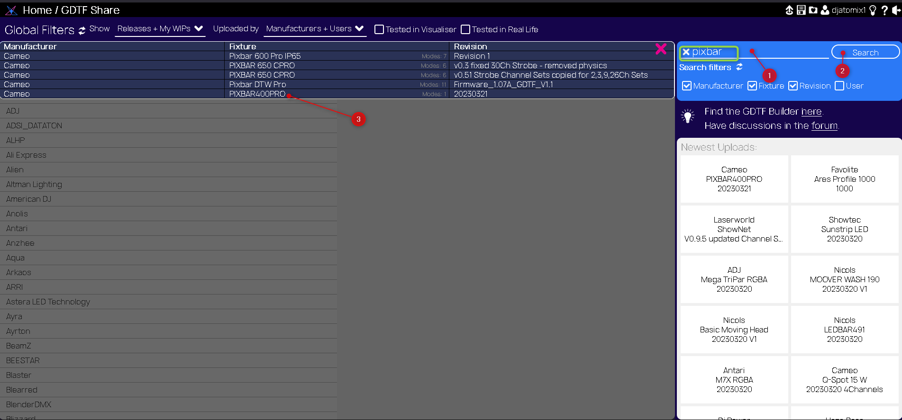

télécharger ou likez pour mettre en favoris
Open builder pour modifier (une revision finale vous est demandé pour ne pas écraser l'originale)

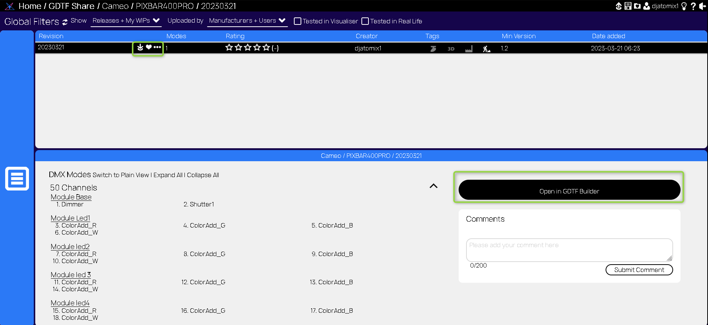

2. créer une nouvelle fixture

Entrez les données importantes

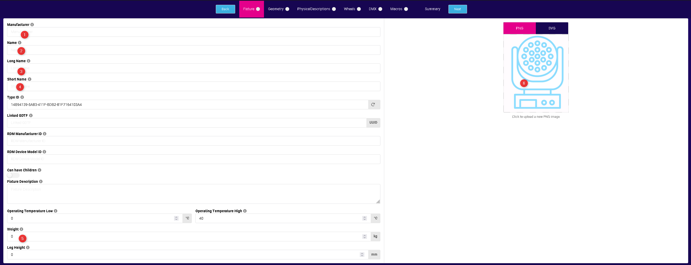

Dans la géométrie, ajouter une forme et son action

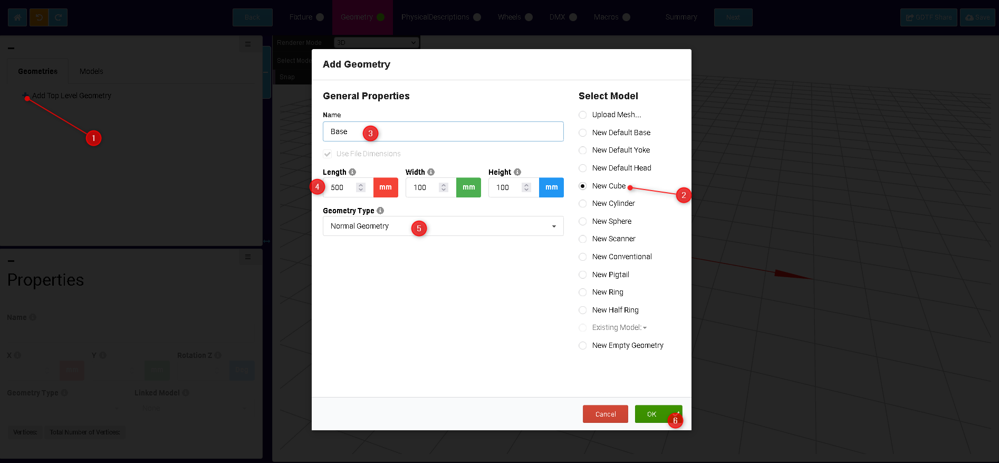

Ajouter une lampe (beam) et regler l'angle d'ouverture

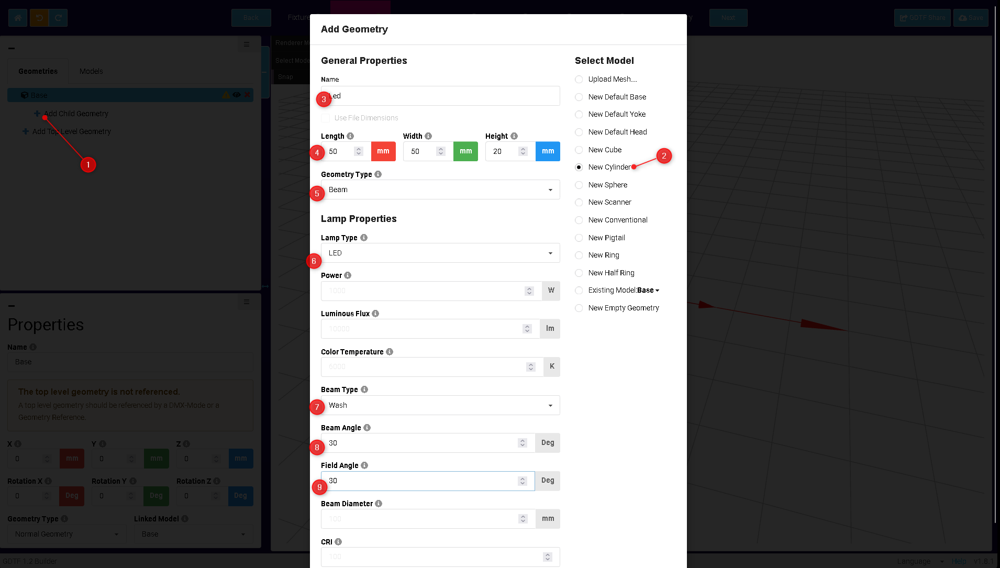

Dans l'onglet DMX, ajouter le mode DMX souhaité sur la bonne géométrie et Ajouter les canaux, un par un

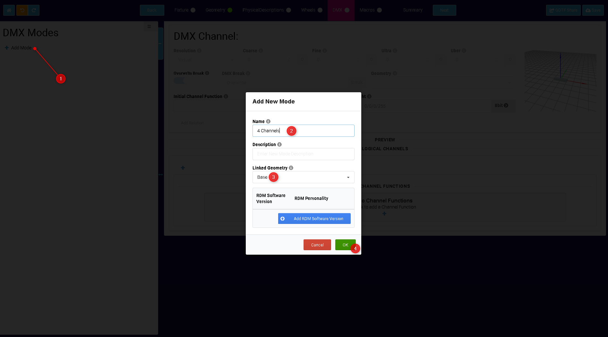

Ajouter le dimmer lié à la bonne géométrie

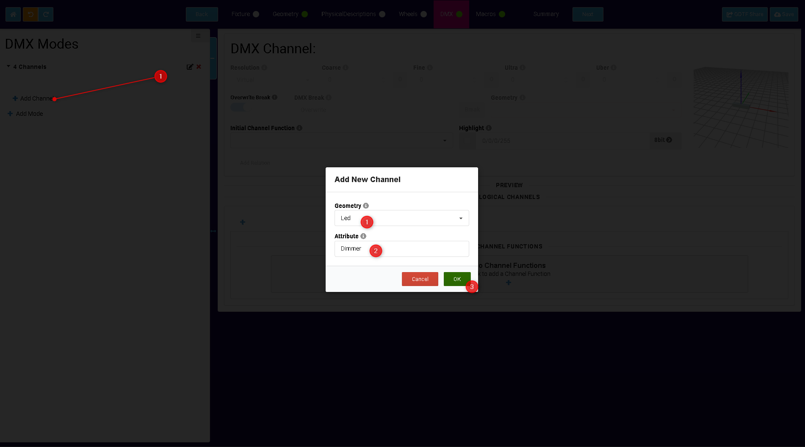

Sélectionner l'attribu du canal

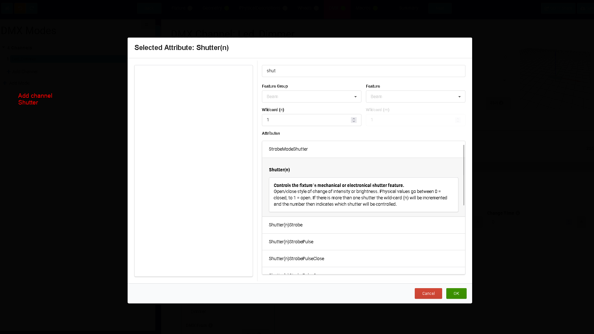

Pour les canaux qui agissent sur la lumière, ne pas oublier de cocher le highlite et entrer 255, ainsi que les valeur logique 1 pour open, 0 pour closed

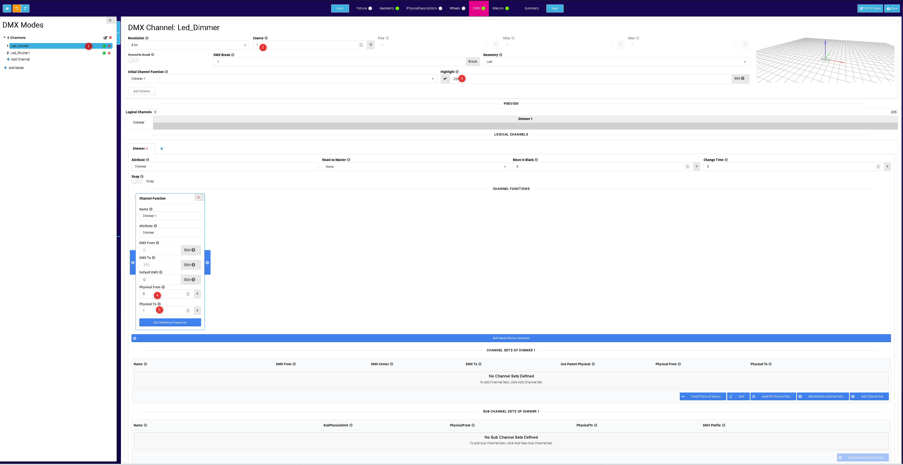

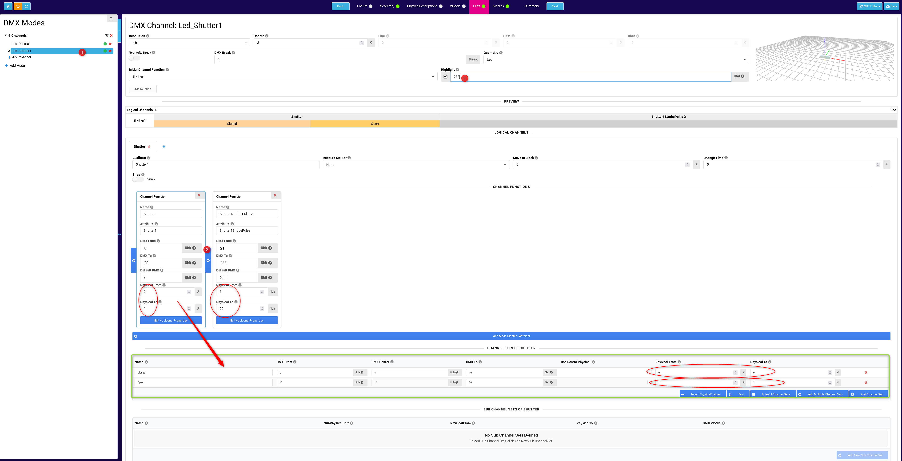

Pour le pan tilt fin, ne pas oublier d'entrer le canal DMX sur fin

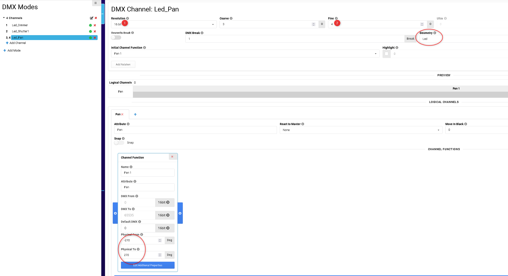

Attention au control du beam (canal ctrl)
ça affiche dans grand ma un second canal qui ne gère que le beam, le pantilt étant dans le premier canal