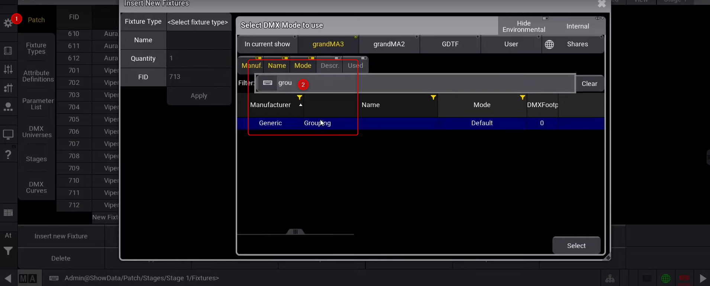
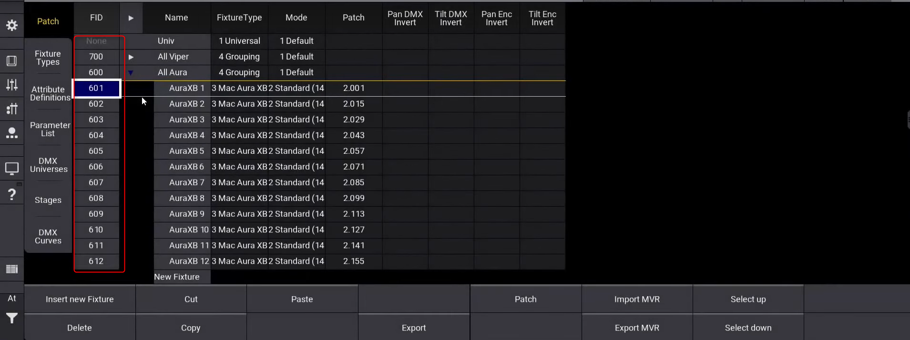
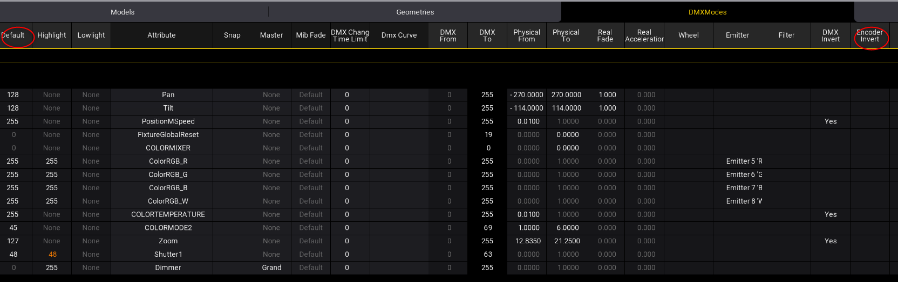
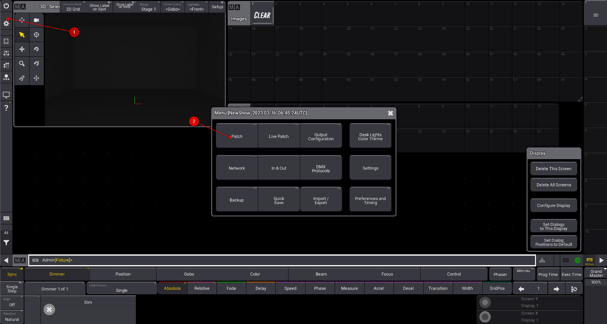
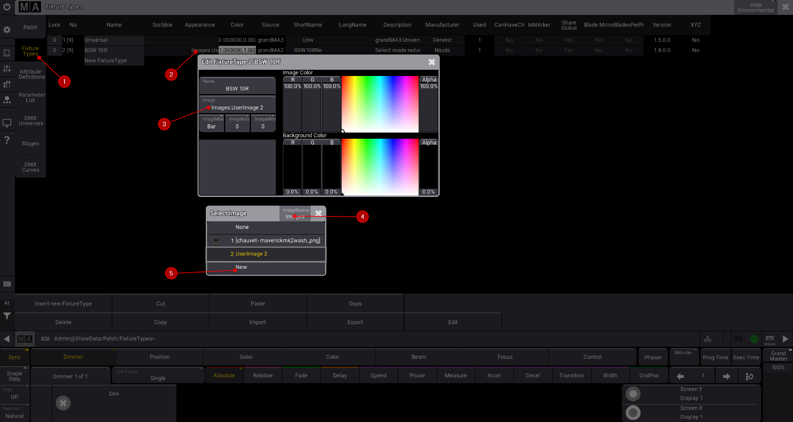
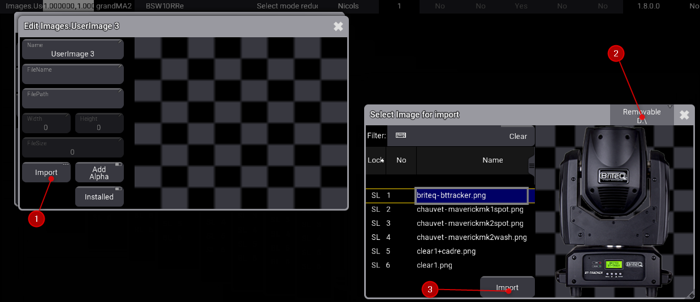

# Patch

* Importer un groupe dans les fixtures pour séparer les appareils, 

* puis importer les appareils dans les groupes
Attention au nommage des ID, prenez soin de suivre les groupes

* Contrôlez les Default:
Patch/ Fixture Type/ Edit / DMX

RGB et W
Réglez le blanc
Réglez le Highlite
Réglez le pan et tilt encoder pour :
    1. Montée de la molette pour monter le tilt vers la salle
    2. Montée de la molette pour aller à droite

*Deplacer un fixture dans le patch

Sélectionner les lignes, coupez, collez dans un nouveau groupe

## photo du produit
* les photos des produits peuvent être enregistrées dans GDTF library ou
* Ajouter des images dans la clé usb
D:\grandMA3\gma3_library\media

* Aller dans patch, fixture type et changer les apparances des appareils

