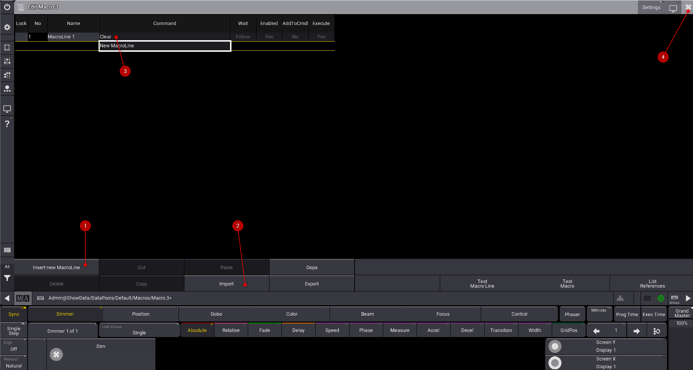

# Les macros

Click droit sur un bouton vide, insérez la nouvelle macro souhaitée ou importez là


* Créer 
1. clear
2. store
3. update
4. oops
5. go

# les lignes de commandes

```C
Store Preset 4.2 thru 4.7
```

# ouvrir le prompt

Pour ouvrir le prompt et répondre à une question, utiliser les paranthèses

# Variable
```C
SetGlobalVariable "FadeTime" ("What fade time?")
```
pour utiliser la variable
```C
$FadeTime
```C

Exemple
```C
Attribute "dimmer" At 100 Delay 0t $DelayTime Thru 0 Fade $FadeTime
```

activer les raccourcis clavier
edit userprofile 1.15 property "KeyboardShortCutsActive"


Off RunningSequence Timecode
Off RunningSequence

Go+ Sequence 10
Off Sequence 15
406 Thru 407
Attribute "ColorRGB*" At 100 
grandma 2: Attribute "ColorRGB1"  At 100
Attribute "dimmer" At 100 
grandma2 : Attribute "dim"  At 100
grandma2 : At Preset 1.2
grandma2 : effect 6
    


SetGlobalVariable "FadeTime" ("What fade time?")
Attribute "dimmer" At Delay 0t $DelayTime Fade $FadeTime