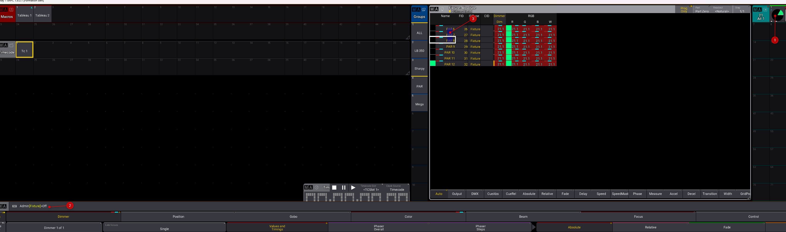

# Les presets

* faire des groupes après avoir sélectionner les fixtures **dans l'ordre souhaité**

* Créer un preset :
1. sélectionner vos fixtures
2. régler le dimmer ou la valeur souhaitée
3. glissé bas gauche sur un preset vide et "store" ou click gauche long ou raccourci Clavier S puis click dans le preset

* Arranger les views
1. utiliser des couleurs qui accélère la lecture
    A. Turquoise : position
    B. Rose : Couleur
    C. Bleu ciel : Beam
    D. Bleu : Gobo
    E. Rouge : controle
    F. Vert : Focus
2. disposer les fenetres pour relier les gobos à la netteté par exemple

* Selectif/Global/Universel
Configurer votre preset en fonction de :
Selectif : que pour les appareils sélectionnés
Global : pour toute les fixtures identiques
Universel : Pour tous les appareils du show

Appui long sur store

* modifier un preset :
1. sélectionner vos fixtures
2. sélectionner le preset à modifier
3. changer à la valeur souhaitée (le jog doit être sur une base colorée)
4. glissé bas gauche sur un preset vide et "store"
5. Cliquer sur merge ou ajouter un réglage ou ouverwrite pour écraser l'ancien réglage

Pour supprimer un appareil d'un preset :
 1. activer le preset, afficher la fixture
 2. Off
 3. selectionner les fixtures dans le tableau

 

* Gestion des paramètres enregistrés dans les presets et séquences

Les Pools preset (hors ALL) filtrent les paramètres et n'enregistrent que leurs paramètres propre

Attention à un pool control ou shutter ou gobo qui pourraient enregistrer 2 valeurs sur un seul preset (Gobo 1 & Gobo 2 additionnés par ex.)

Le preset n'enregistre que les paramètres modifiés (en LIGNE rouge)

    1. Pour supprimer un paramètre non désiré, OFF puis click sur le paramètre
    2. Pour ajouter un paramètre : Double click sur Dimmer par exemple
    3. Pour retirer un paramètre d'un preset déjà enregistré :
        on sélectionne le preset, on double click sur le paramètre à supprimer (la ligne devient rouge) Store + click preset + Remove

Pour afficher les listes des paramètres qui vont s'enregistrer dans le preset : Fixture Sheet et Prog Only

Please please (entrer entrer) pour sélectionner tous les paramètres d'un projecteur

* Delay

1. cliquez sur delai, et entrer 0 thru 2 pour faire un démarrage progressif des appareils de gauche à droite
2. 2 thru 0 de droite à gauche
3. 2 thru 0 thru 2 des exterieurs vers le centre
4. 0t2t0 du centre vers les extérieurs

