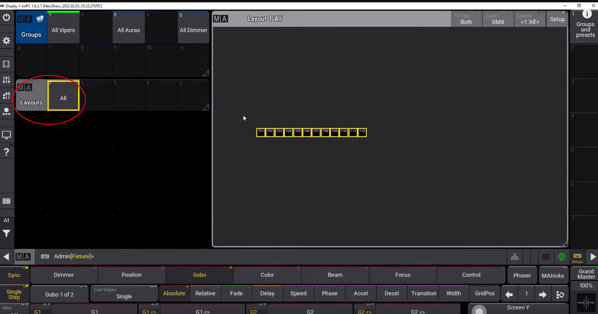

# les views layout

* créer plusieurs views

Vous pouvez créer plusieurs views layout (sol plafond) sélectionnables sur le pool layout

Glissé bas pour accéder au store et enregistrer un nouveau layout

* insérer un fixture dans layout

cliquez sur le group intéressé, assign et click dans la layout view

il est possible d'ajouter l'icone du group dans la layout view 
1. Assign
2. click sur le groupe souhaité
3. click dans le vide du layout

Click droit sur l'icone pour changer l'apparence

ll 