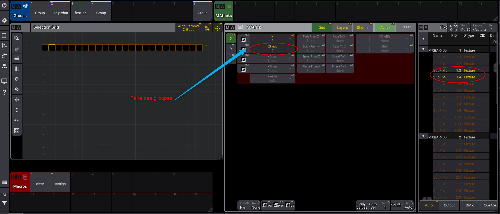

# Les matrices

Créer une view spécial matrix, avec 
1. macro
2. groupe
3. matrice pool
4. matrice other
5. fixture

Déplacer le carré bleu à l'endroit où l'on mettrte le fixture et sélectionner les fixtures au fur et à mesure

Par exemple les lignes de LED

* Changer des pas

* Faire des groupes

* faire des groupes 1 sur 4

* grouper les extrémités

* Changer de sens

* miroir

* Enregistrer la position souhaitée dans un groupe

## Faire une séquence

1. sélectionner le groupe
2. choisir la modif DMX
3. changer de pas
4. choisir la modif DMX

5. ajouter une phase

Régler le sens de la phase dans la matricks

6. Cliker sur shuffle

