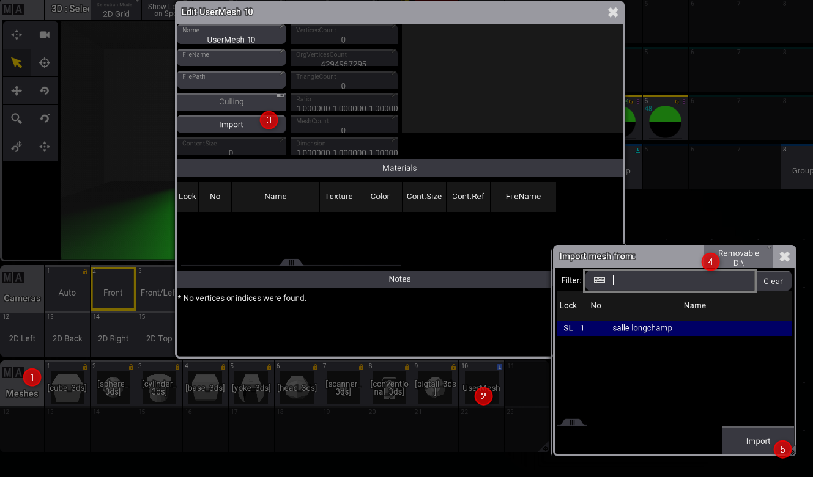

# La 3D

* Sélectionner les fixtures, cliquer sur SETUP et profiter des jogs positions et rotation pour déplacer vos fixtures

* aligner plusieurs fixtures entre -2 et 2

* insérer une forme 3D

Insérer le fichier 3DS dans le dossier 
D:\grandMA3\gma3_library\fixturetyperesources\meshes
Aller dans la pool meshes, éditer une nouvelle mesh.
Importer un fichier de la clé USB

Aller dans le patch, insérer une nouvelle fixture type, puis éditer là.

Aller dans géométrie, en ajouter un axis

Aller dans modèles et insérer un mesh

* follow pan/tilt

